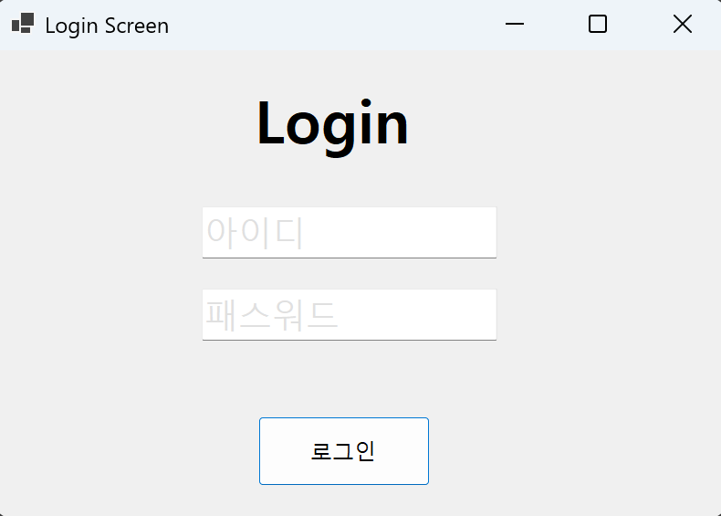
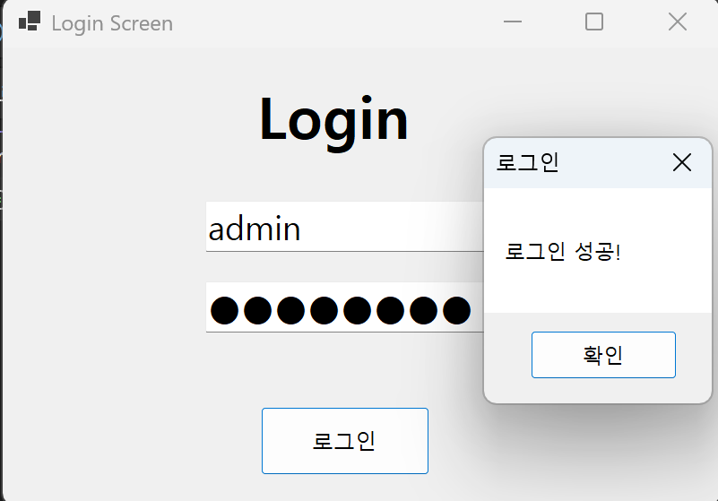
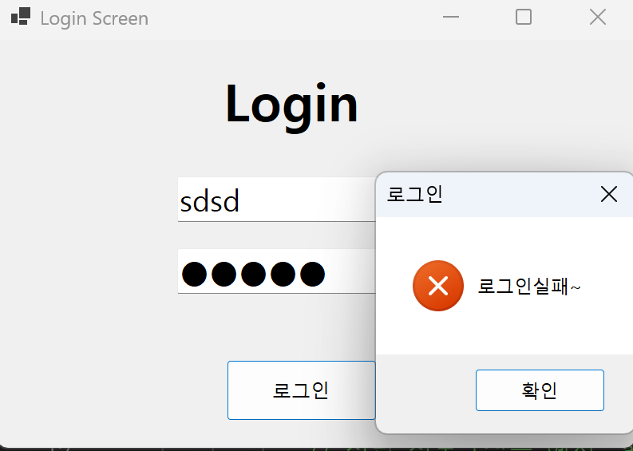

# (C# 코딩)로그인 스크린

## 개요

- C# 프로그래밍 학습
- 1줄 소개: 사용자로부터 아이디와 비밀번호를 입력받아 일치 여부를 확인하고 보안 및 예외 처리가 적용된 기초적인 로그인 인증 프로그램
- 사용한 플랫폼 :
  - C#, .NET Windows Forms, Visual Studio, GitHub
- 사용한 컨트롤:
  - Label, TextBox (txtID, txtPW), Button (btnLogin)
- 사용한 기술과 구현한 기능:
  - Visual Studio를 이용하여 로그인 UI 디자인 및 컨트롤 배치
  - UseSystemPasswordChar 속성을 활용한 비밀번호 마스킹 보안 처리
  - 논리 연산자 &&를 사용하여 아이디와 비밀번호의 동시 일치 여부 판별
  - if-else 조건문을 통한 로그인 성공 및 실패 시나리오 분리
  - MessageBox.Show 메서드를 이용한 인증 결과 팝업 알림 기능
  - IsNullOrWhiteSpace 메서드를 이용한 빈 값 입력 예외 처리
  - Click 이벤트를 이용한 로그인 로직 실행 및 사용자 피드백 제공
  - Placeholder 회색 텍스트 구현하여 사용자 편의성 증가

 ## 실행 화면 (과제1)
 - 과제1 코드의 실행 스크린샷  
  
  
  

  - 과제 내용
  - Label (아이디/패스워드), TextBox (입력), Button (로그인)을 적절히 배치합니다.
  - 정답 정보(admin, superman)를 설정하고 입력값과 일치하는지 판별합니다.
  - 텍스트박스에 플레이스홀더 기능을 구현하여 사용자 편의성을 높입니다.
  - Enter 키 입력을 감지하여 포커스 이동 및 로그인 실행 기능을 구현합니다.

- 구현 내용과 기능 설명
  - Label, TextBox, Button을 폼에 배치하여 기본 로그인 UI를 구성했다.
    사용한 코드:
    InitializeComponent();
  - 아이디와 패스워드가 모두 맞아야 성공하도록 논리 연산자를 사용했다.
    사용한 코드:
    if (txtID.Text == myID && txtPW.Text == myPW)
  - 포커스가 들어오면 힌트가 사라지고 글자색이 검정으로 변경되도록 했다.
    사용한 코드:
    if (txtID.Text == "아이디") { txtID.Text = ""; txtID.ForeColor = Color.Black; }
  - 입력창이 비어있는 상태로 포커스가 나가면 다시 회색 힌트가 나타난다.
    사용한 코드:
    if (string.IsNullOrWhiteSpace(txtID.Text)) { txtID.Text = "아이디"; txtID.ForeColor = Color.Silver; }
  - 패스워드 입력 시에만 마스킹이 활성화되고 힌트 상태에서는 글자가 보이게 제어했다.
    사용한 코드:
    txtPW.UseSystemPasswordChar = true; (Enter 이벤트 시 적용)
  - 아이디 입력 중 Enter 키를 누르면 패스워드 창으로 포커스가 이동한다.
    사용한 코드:
    if (e.KeyCode == Keys.Enter) txtPW.Focus();
  - 패스워드 입력 중 Enter 키를 누르면 로그인 버튼이 클릭된 것과 동일하게 작동한다.
    사용한 코드:
    btnLogin.PerformClick();
  - 로그인 시도 결과에 따라 성공 및 실패 메시지 박스가 출력되도록 구현했다.
    사용한 코드:
    MessageBox.Show("로그인성공!", "로그인", MessageBoxButtons.OK);